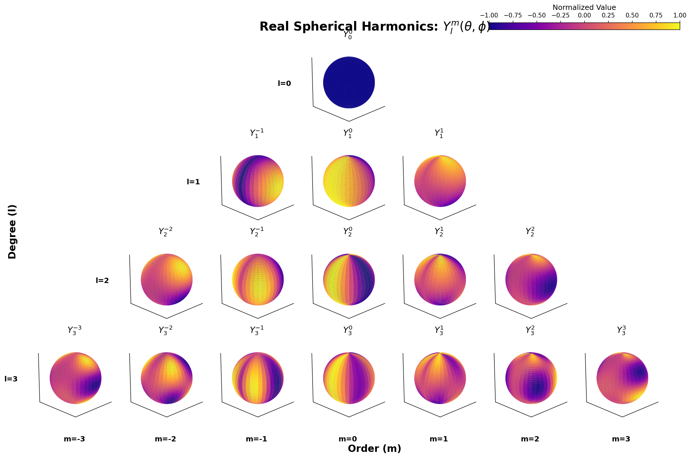
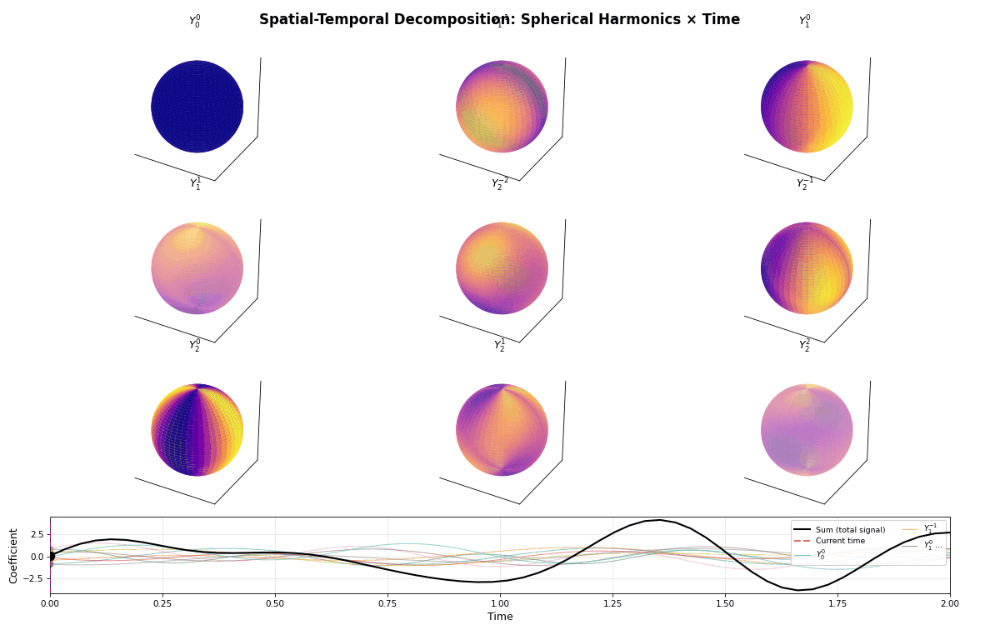

# fNIRS Analysis Package

A Python package for spatial-temporal analysis of functional near-infrared spectroscopy (fNIRS) data, with a focus on hemodynamic response modeling using spherical harmonics and Fourier basis functions.

## Overview

This package provides tools for:
- Loading fNIRS data from SNIRF and MATLAB formats
- Projecting 3D channel coordinates onto spherical surfaces
- Spatial-temporal modeling using spherical harmonics and Fourier basis
- Hemodynamic signal processing and artifact removal
- Visualization of fNIRS data and model results

## Installation

First, clone the repository:

```bash
git clone git@github.com:andycasey/fnirs.git
cd fnirs
```

Or via HTTPS:

```bash
git clone https://github.com/andycasey/fnirs.git
cd fnirs
```

### Install uv (recommended)

If you don't have `uv` installed yet, install it first:

```bash
# On macOS and Linux
curl -LsSf https://astral.sh/uv/install.sh | sh

# On Windows
powershell -c "irm https://astral.sh/uv/install.ps1 | iex"

# Or with pip
pip install uv
```

More details at: https://docs.astral.sh/uv/getting-started/installation/

### Using uv (recommended)

```bash
uv pip install -e .
```

### Using pip

```bash
pip install -e .
```

### Optional dependencies

For mesh refinement capabilities (requires Python 3.12 or earlier):

```bash
uv pip install -e ".[mesh]"
```

## Quick Start

```python
from fnirs import (
    load_hemodynamic_data,
    project_fnirs_to_sphere,
    fit,
)
import jax.numpy as jnp

# Load data
hemo_data = load_hemodynamic_data("path/to/data.mat")

# Project coordinates onto sphere
coords_3d = hemo_data.get_spatial_coordinates_3d()
sphere_result = project_fnirs_to_sphere(coords_3d)
θ, ϕ = sphere_result['theta'], sphere_result['phi']

# Fit spatial-temporal model
t = jnp.array(hemo_data.time)
Y = jnp.array(hemo_data.get_hbo_data().T)  # Shape: (n_channels, n_timepoints)

X, f, *extras = fit(
    t,
    jnp.array(θ),
    jnp.array(ϕ),
    Y,
    max_spherical_degree=5,
    n_fourier_components=len(t)
)

# Get predictions
Y_predicted = f(X)
```

**Testing:** To verify the Quick Start instructions work, run:
```bash
python test_quickstart.py
```

## Visualization

### Spherical Harmonics Basis Functions

The package uses real spherical harmonics as spatial basis functions. Here are the first 16 basis functions (l=0 to 3):



Each sphere shows a different spherical harmonic Y_l^m, colored by the plasma colormap to show the spatial pattern.

### Spatial-Temporal Decomposition Demo

The animation below demonstrates how the model works: spatial patterns (spherical harmonics) are weighted by temporal coefficients that change over time. The **black line** shows the sum of all contributions:



- **Top grid**: Spheres showing different spatial patterns (opacity indicates current contribution)
- **Bottom plot**: Temporal coefficients (colored lines) and their sum (black line)
- As time progresses, each sphere's opacity changes to show its contribution

### Why This Approach?

In fNIRS, we are measuring samples of an underlying latent field: the hemoglobin concentration beneath the skull. However, we can only measure at discrete channel positions determined by our source-detector pairs—we cannot sample everywhere we might want. Additionally, all measurements are corrupted by noise from various sources (physiological, instrumental, motion artifacts, etc.).

Traditional fNIRS analysis often treats each channel independently, computing statistics per channel and then comparing correlation coefficients between signals in different channels. This approach has limitations: it ignores the spatial structure of the hemodynamic response, treats noisy measurements as ground truth, and doesn't leverage the fact that nearby channels are measuring the same underlying continuous field.

Instead, this package takes a different approach: we fit all the data simultaneously to learn the underlying hemoglobin concentration field everywhere beneath the skull. By modeling the spatial-temporal structure with basis functions (spherical harmonics for space, Fourier components for time), we can:
- Pool information across all channels to better estimate the true underlying field
- Denoise measurements by fitting smooth spatial-temporal patterns
- Interpolate and extrapolate to regions between measurement points
- Obtain a coherent representation of the entire hemodynamic response

This unified spatial-temporal modeling approach provides a more principled and powerful framework for analyzing fNIRS data than traditional channel-by-channel methods.

## Examples

### Notebooks

The `notebooks/` directory contains example analyses:

- `spatial_temporal_modeling.py` - Complete pipeline for spatial-temporal modeling of hemodynamic data

To run the notebooks, you'll need marimo:

```bash
uv pip install marimo
marimo edit notebooks/spatial_temporal_modeling.py
```

### Visualizations

The `scripts/` directory contains visualization tools:

- `visualize_spherical_harmonics_animation.py` - Create animated visualizations showing how spherical harmonics combine with temporal basis functions

Example:
```bash
python scripts/visualize_spherical_harmonics_animation.py 2 5.0 figures/demo.gif
```

See `scripts/README.md` for details.

## Features

### Data Loading

- **SNIRF Format**: Load data from the Shared Near Infrared Spectroscopy Format
- **MATLAB Format**: Load preprocessed hemodynamic concentration data from MATLAB files

### Spatial Processing

- **Spherical Projection**: Project 3D channel coordinates onto a fitted sphere
- **Coordinate Systems**: Handle both 2D and 3D coordinate systems
- **Mesh Refinement**: Optional advanced mesh refinement using Open3D (requires `mesh` extras)

### Temporal Modeling

- **Fourier Basis**: Real-valued Fourier basis functions for temporal modeling
- **Spherical Harmonics**: Spatial basis functions on the sphere
- **Joint Modeling**: Efficient joint spatial-temporal basis decomposition

### Signal Processing

- **Short-Separation Regression**: Remove systemic physiological noise
- **PCA-based Artifact Removal**: Principal component analysis for noise reduction
- **Physiological Regression**: Regress out known physiological signals

## Data Format

### MATLAB Data

The package expects MATLAB files with the following structure:

- `dc`: Hemodynamic concentration data (timepoints × channels × chromophores)
- `SD`: Probe configuration structure containing:
  - `nSrcs`, `nDets`: Number of sources and detectors
  - `Lambda`: Wavelengths
  - `f`: Sampling frequency
  - `SrcPos`, `DetPos`: 2D source/detector positions
  - `SrcPos_3d`, `DetPos_3d`: Optional 3D positions
  - `MeasList`: Measurement list

### SNIRF Data

Supports the SNIRF v1.1 specification. See: https://github.com/fNIRS/snirf

## Contributing

Contributions are welcome! Please feel free to submit a Pull Request.

## References

- Homer2 User Guide: https://www.nmr.mgh.harvard.edu/martinos/software/homer/HOMER2_UsersGuide_121129.pdf
- SNIRF Specification: https://github.com/fNIRS/snirf

## License

MIT License
