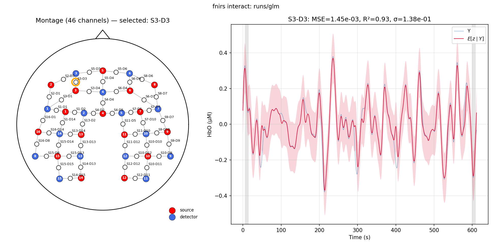

# fNIRS Analysis Package

A Python package for end-to-end functional near-infrared spectroscopy (fNIRS) analysis: a clean preprocessing pipeline from raw intensity to HbO/HbR concentration, plus a **joint multichannel spatio-temporal Gaussian Process** model fit by Whittle likelihood for connectivity estimation. Replaces the older spherical-harmonic model entirely.

## Model

For each subject's recording, the model is

```
y_i(t) = z_i(t) + ε_i(t),     i = 1..N (channels)
z(t)   ~ GP(0, Σ ⊗ k_t)        joint multivariate GP across channels
ε_i(t) ~ N(0, σ_i²)            per-channel iid noise
k_t    = Matérn-3/2 with shared length scale ell
Σ      = L Lᵀ + diag(d), L ∈ ℝ^{N×r}    low-rank-plus-diagonal connectivity
```

The N×N channel covariance Σ is the scientifically interesting object — its correlation matrix is the *connectivity*. The model is fit by maximising the Whittle (frequency-domain) log-likelihood with L-BFGS-B; per-frequency factorisation makes this O(N³ + T log T + T·N²) per evaluation. Optional Student-t Whittle likelihood for robustness; optional CompCor-style PCA on GLM residuals as an aggressive backup confound regression.

## Installation

```bash
git clone git@github.com:andycasey/fnirs.git
cd fnirs
uv pip install -e .         # or: pip install -e .
```

If you don't have `uv` ([install instructions](https://docs.astral.sh/uv/getting-started/installation/)), `pip install -e .` works.

## Pipeline at a glance

```
raw .snirf / .lob
       │
       │   fnirs preprocess
       ▼
preprocessed .snirf  (HbO/HbR in μM)
       │
       │   fnirs fit
       ▼
model.npz + plots/
       │
       │   fnirs interact (interactive)
       │   fnirs montage  (topographic summary)
       ▼
diagnostics
```

## 1) Preprocess raw data

`fnirs preprocess` ingests raw intensity (`.snirf` or `.lob`), applies motion correction + bandpass + spike removal in optical-density space, then converts to ΔHbO / ΔHbR via the Modified Beer-Lambert law and writes a SNIRF file (units: μM).

```bash
# Default pipeline: TDDR + Hampel + wavelet despike + bandpass [0.009, 0.08] Hz
fnirs preprocess data/Raw_RightOnly.snirf
# → writes data/Raw_RightOnly.snirf in place (HbO + HbR channels in μM)

# Save to a different file
fnirs preprocess raw.snirf -o cleaned.snirf

# .lob input — output path required
fnirs preprocess Session1.lob -o Session1.snirf

# Toggle individual steps
fnirs preprocess raw.snirf --no-tddr --no-wavelet
fnirs preprocess raw.snirf --bandpass-low-hz 0.01 --bandpass-high-hz 0.1

# Hampel filter (sample-wise spike removal) and wavelet despike thresholds
fnirs preprocess raw.snirf --hampel-window 7 --hampel-k 4 --wavelet-iqr 1.5

# Different partial pathlength factors per wavelength
fnirs preprocess raw.snirf --ppf-w1 6.0 --ppf-w2 6.0
```

The pipeline (in OD space, after `intensity → -log(I/Ī)`):

1. **TDDR** motion correction (Fishburn et al. 2019, NeuroImage) — IRLS-suppressed temporal-derivative outliers.
2. **Hampel filter** sample-wise spike removal (median ± k·MAD in a sliding window).
3. **Wavelet despike** (db2 by default → sym5; MAD-σ thresholding on detail coefficients).
4. **Bandpass filter** Butterworth [0.009, 0.08] Hz (configurable).
5. **Modified Beer-Lambert** → HbO and HbR using the full extinction-coefficient table; output in μM.

The auto-detected `--input-label` picks whichever data_type_label has channels at every wavelength index (typical values: `RAW`, `raw-DC`, `dOD`). Override with `--input-label LABEL` if needed.

## 2) Fit the joint GP

`fnirs fit` reads the preprocessed SNIRF, applies a GLM regression of nuisance signals (drift + HRF×stim + short-channel time series), splits time into train/validation chunks per channel, fits the joint Whittle GP, then re-fits a second pass with per-channel σ pinned at the validation residual RMS so that Σ is identified by data:

```bash
fnirs fit data/preprocessed.snirf runs/my-fit
```

That single command runs the full default pipeline:

| flag | default | what it does |
|---|---|---|
| `--rank` | `4` | low-rank `Σ = LLᵀ + diag(d)` with `L ∈ ℝ^{N×4}` |
| `--log-sigma-min`, `--log-sigma-max` | `2.6`, `4` | bounds on per-channel noise log-std |
| `--max-length-scale` | `60` | cap on Matérn-3/2 ell (samples) |
| `--regress-short-channels` | on | OLS regress short-HbO time series out of long channels |
| `--regress-stim` | on | OLS regress HRF×stim_boxcar out of long channels |
| `--regress-drift` | on | linear drift regressor |
| `--validation-fraction`, `--validation-chunk-size` | `0.1`, `30` | random per-channel chunks held out for χ² calibration |
| `--two-pass` | on | refit with σ_i fixed at validation residual RMS — identifies σ from data |
| `--seed-channel-index`, `--seed-k-neighbors` | `6`, `2` | seed-based connectivity summary |
| `--n-iter` | `10000` | max LBFGS iterations |

What gets printed at the end of a successful fit (real data example):

```
Fit complete.
  Channels:        46
  Length scale:    44.96 samples (8.84 s)
  LBFGS iters:     200  (converged=True)
  Noise std range: 0.0781 .. 0.1953
  Rank:            4 (of 46)
  Reduced χ² (train):  total=0.0508    range=[0.0187, 0.2246]
  Reduced χ² (val):    total=0.6916    range=[0.3250, 1.0462]
  FC (Pearson r on E[z|Y], denoised): mean |r|=0.2270   median |r|=0.1982   max |r|=0.7808
  FC (Pearson r on raw Y, comparison): mean |r|=0.2228   median |r|=0.1838   max |r|=0.7830
  Seed channel:    row 6 (S3-D3)
    K=2 closest channels: S2-D3, S5-D3
    max |corr| over K closest:  data=0.5944    model=0.1479    resid=0.0921
```

The val χ² ≈ 1 means the model is well-calibrated (held-out residual RMS ≈ inferred σ). The FC line gives the field-standard fNIRS functional-connectivity correlation coefficient — Pearson r computed on the GP's denoised latent E[z|Y].

### Common variations

```bash
# Robust Student-t Whittle likelihood (for outlier-prone data)
fnirs fit data.snirf out --nu 6

# Aggressive CompCor-style data-driven PCA on GLM residuals
fnirs fit data.snirf out --post-glm-pca-components 3

# Only some preprocessing steps
fnirs fit data.snirf out --no-regress-short-channels --no-regress-stim

# Use a different validation regime
fnirs fit data.snirf out --validation-mode disjoint   # matrix-completion CV
fnirs fit data.snirf out --validation-mode synchronous # tests temporal kernel only
```

`fnirs fit --help` for the full list.

### Outputs

`runs/my-fit/model.npz` contains the fitted Σ (`sigma`, `correlation`), per-channel noise variance, latent posterior mean, training/validation residuals, GLM design + betas, and validation-mask metadata. `runs/my-fit/figures/` gets seven diagnostic plots: `connectivity.png`, `correlation.png`, `noise_std.png`, `loss_curve.png`, `channel_traces.png`, `latent_draws.png`, `residuals.png`, `power_spectrum.png`. Pass `--no-plots` to skip them.

## 3) Inspect with `fnirs interact`

```bash
fnirs interact runs/my-fit
```

Opens a two-panel interactive window: hover over any channel on the head montage (left) to see its raw trace, posterior mean, and ±σ band on the right.



- **Left**: head outline + nose; sources (red, with index labels), detectors (blue, with index labels), channels at midpoints labelled `S{src}-D{det}`. Held-out validation chunks (gold) and stim periods (grey) appear as background bands on the right panel.
- **Right**: blue is `Y` (preprocessed data), dashed crimson is `E[z|Y]` (GP posterior mean), shaded crimson band is `±σ_i`. Title shows MSE, R², σ.

The hover updates which channel is shown. Same montage layout is used by `fnirs montage` for static topographic summaries.

## 4) Topographic summaries with `fnirs montage`

Static head-montage plot of any per-channel scalar (e.g., signal std) over the same layout as `fnirs interact`:

```bash
fnirs montage data/preprocessed.snirf --metric std
fnirs montage data/preprocessed.snirf --metric rms --chromophore hbr
fnirs montage data/preprocessed.snirf --metric var --log-scale --cmap inferno
```

Useful for comparing per-channel signal properties against published topographic plots.

## API

```python
from fnirs import (
    load_snirf_data, load_lob_data, save_concentration_snirf,
    fit, neg_log_likelihood, posterior_mean, sigma_from_params, correlation_from_params,
)
from fnirs.preprocess import (
    tddr, bandpass_filter, wavelet_despike, hampel_filter,
    intensity_to_od, od_to_concentration, preprocess_optical_density,
)

# Load
nd = load_snirf_data("data/raw.snirf")     # raw intensity NIRSData
nd = load_lob_data("data/Session1.lob")    # raw .lob NIRSData

# Preprocess (per channel)
import numpy as np
intensity = nd.time_series.T               # (n_channels, n_timepoints)
fs = 1.0 / np.median(np.diff(nd.time))
od = intensity_to_od(intensity)
od_clean = preprocess_optical_density(od, fs)
# ...then od_to_concentration → save_concentration_snirf

# Fit the joint GP
import numpy as np
Y = ...                                     # (n_long_channels, n_timepoints), HbO in μM
res = fit(Y, rank=4, init_length_scale=30, n_iter=10000,
          log_sigma_min=2.6, log_sigma_max=4.0,
          log_ell_max=np.log(60))
print(res["correlation"])                   # connectivity matrix
```

## Data formats supported

- **SNIRF v1.1**: read + write (concentration data). https://github.com/fNIRS/snirf
- **`.lob`** (cw_nirs MATLAB MCOS objects): read-only; `fnirs preprocess` writes the result as SNIRF.
- **MATLAB hemodynamic** (`dc`, `SD`): read-only via `load_hemodynamic_data`.

## Tests

```bash
python -m pytest test_preprocess.py test_whittle.py test_cli.py
```

## License

MIT
